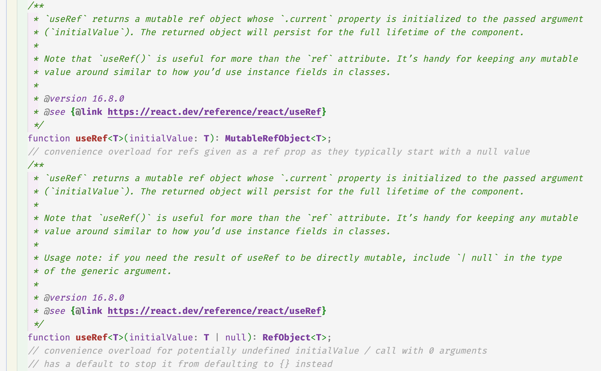

# [9장 Hook](https://velog.io/@iberis/9장-Hook)

## useEffect 와 비동기

useEffect 에서 비동기 함수를 직접 호출하면 경쟁 상태(race condition) 를 불러일으킬 수 있으므로 비동기 함수를 정의하고 동기적으로 호출해야한다.

```tsx
// 비동기 함수를 직접 호출한 경우
import React, { useState, useEffect } from 'react';

function ExampleComponent({ userId }) {
  const [data, setData] = useState(null);

  useEffect(() => {
    const fetchData = async () => {
      const response = await fetch(`https://api.example.com/user/${userId}`);
      const result = await response.json();
      setData(result);
    };

    fetchData();
  }, [userId]); // userId가 변경될 때마다 useEffect가 실행

  return (
    <div>
      {data ? <p>{data.name}</p> : <p>Loading...</p>}
    </div>
  );
}
```
userId가 바뀔 때마다 useEffect가 다시 실행되며, fetchData 함수가 호출된다. 만약 userId가 매우 빠르게 변경된다면, 이전 요청이 완료되지 않은 상태에서 새로운 요청이 발생하여 이전 데이터가 무시되거나, 이전 응답이 나중에 도착하면 데이터가 엉키는 상황(경쟁 상태, Race Condition)이 발생할 수 있다.

- 예를 들어, userId가 1에서 2, 그리고 3으로 순차적으로 변경되었지만, 네트워크 응답 속도가 달라서 userId가 1일 때 요청한 응답이 가장 나중에 도착하는 경우 화면에 3이 아닌 1의 데이터가 나타날 수 있다.

```tsx
// 비동기 함수를 동기적으로 호출 + cleanup 으로 이전 요청 상태 업데이트 예방
import React, { useState, useEffect } from 'react';

function ExampleComponent({ userId }) {
  const [data, setData] = useState(null);

  useEffect(() => {
    let isSubscribed = true; // Cleanup을 위한 플래그

    const fetchData = async () => {
      const response = await fetch(`https://api.example.com/user/${userId}`);
      const result = await response.json();
      if (isSubscribed) {
        setData(result); // 플래그가 true일 때만 상태 업데이트
      }
    };

    fetchData();

    return () => {
      isSubscribed = false; // cleanup 단계에서 플래그를 false로 변경
    };
  }, [userId]);

  return (
    <div>
      {data ? <p>{data.name}</p> : <p>Loading...</p>}
    </div>
  );
}
```
isSubscribed라는 플래그 변수를 사용하여 fetchData가 실행된 후, 이 플래그가 설정된 상태일 때만 setData를 업데이트한다. 이를 통해 새로운 userId가 설정되면 이전 요청의 상태 업데이트를 방지할 수 있어 경쟁 상태를 예방할 수 있다.

즉,
1. 함수 표현식을 사용하여 useEffect 안에서 비동기 함수를 호출하는 것이 아니라, 비동기 함수를 정의하고 동기적으로 호출해야한다.
2.  비동기 함수가 여러 번 호출될 경우, 이를 cleanup을 통해 처리하여 이전 요청의 상태 업데이트를 막을 수 있다.

> **클로저와 isSubscribed의 관계**\
useEffect는 userId가 변경될 때마다 새로 실행된다. 이때 각 useEffect는 고유의 fetchData 함수와 isSubscribed 플래그를 가진 환경을 가지며, 이전 useEffect에서 생성된 클로저(비동기 작업) 역시 이 당시에 선언된 isSubscribed 의 최신 값을 참조한다.\
따라서 첫 번째 useEffect에서의 isSubscribed와 두 번째 useEffect에서의 isSubscribed는 서로 다른 스코프에서 독립적으로 존재하며, 이전 요청이 완료되었을 때에는 cleanup 에서 변경한 이전 값(isSubscribed = false)을 참조하므로 상태 업데이트를 막을 수 있다.


## useEffect 와 useLayoutEffect 차이

useEffect 와 useLayoutEffect 는 첫 번째 함수로 받는 콜백함수의 실행 순서가 차이난다.

useEffect 는 레이아웃 배치와 화면 렌더링이 모두 완료된 후 콜백 함수를 실행한다.
useLayoutEffect 는 화면에 해당 컴포넌트가 그려지기 전에 콜백 함수를 실행한다.

https://codesandbox.io/p/sandbox/useeffect-uselayouteffect-qnjxw3


## useRef

 `useRef<HTMLDivElement | null>` 로 타입에 null 을 지정해주면 `ref.current = 다른 값` 으로 변경할 수 있지만\
  `useRef<HTMLDivElement>` 로 타입에 null 을 지정하지 않으면 변경할 수 없다.

```tsx
import { useEffect, useRef } from "react";

const MyComponent = () => {
  const canChangeRef = useRef<HTMLDivElement | null>(null);
  const canNotChangeRef = useRef<HTMLDivElement>(null);

  useEffect(() => {
    canChangeRef.current =
      document.querySelector<HTMLDivElement>("#canNotChangeRef");
    canNotChangeRef.current =
      document.querySelector<HTMLDivElement>("#canChangeRef"); // Error Cannot assign to 'current' because it is a read-only property.
  }, []);

  return (
    <div>
      <div id="canChangeRef" ref={canChangeRef}>
        can Change Ref
      </div>
      <div id="canNotChangeRef" ref={canNotChangeRef}>
        can Not Change Ref
      </div>
    </div>
  );
};

```

```ts
  interface MutableRefObject<T> {
      current: T;
  }


  * ```tsx
  * const ref = createRef<HTMLDivElement>();
  *
  * ref.current = document.createElement('div'); // Error
  * ```
  */

  interface RefObject<T> {
      /**
       * The current value of the ref.
       */
      readonly current: T | null;
  }

```
useRef 는 MutableRefObject 또는 RefObject 를 반환한다. 
MutableRefObject 는 readonly current T | null 로 값을 임의로 변경할 수 없다.

## [useImperativeHandle](https://react.dev/reference/react/useImperativeHandle)

forwardRef 와 함께 사용하여, 부모 컴포넌트에서 ref 를 통해 자식 컴포넌트에서 정의한 커스터마이징 된 메서드를 호출할 수 있다.

https://codesandbox.io/p/sandbox/wljdx4